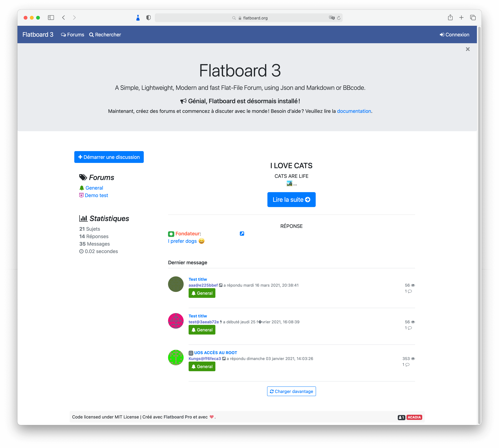

Flatboard 5     

===================

Fast and lightweight flat-file forum software, powered by JSON or SQLite.
We're just getting started, so if you have any questions, comments, bugs to report or enhancements that should be implemented, please do feel free to post those here on GitHub.  
Online demo/support: https://flatboard.org

## Getting Started
- [Installation](#installation)
- [License](#license)

## REQUIREMENTS

#### System requirements
Make sure your server meets the following requirements.

- [x] Web Server (Apache 2.4 with mod_rewrite or Nginx)
- [x] PHP 8.0 or higher

#### PHP extensions
Flatboard 5 needs the following PHP extensions to be enabled:

**Required:**
- [x] PHP [json](https://php.net/manual/en/book.json.php) module for JSON manipulation (usually included).
- [x] PHP [mbstring](http://php.net/manual/en/book.mbstring.php) module for full UTF-8 support.
- [x] PHP [openssl](http://php.net/manual/en/book.openssl.php) module for security features.

**Recommended:**
- [x] PHP [fileinfo](http://php.net/manual/en/book.fileinfo.php) module for secure MIME type validation of uploaded files.
- [x] PHP [zip](http://php.net/manual/en/book.zip.php) module for ZIP archive content analysis.
- [x] PHP [pdo_sqlite](http://php.net/manual/en/book.pdo.php) module if using SQLite storage (Pro only).
- [x] PHP [gd](http://php.net/manual/en/book.image.php) or [imagick](http://php.net/manual/en/book.imagick.php) module for avatar generation and image processing.

## Installation
1. Download the latest version from [flatboard.org](https://flatboard.org/resources/flatboard)
2. Extract the archive.
3. Upload all files to your server/hosting.
4. Visit your domain http://domain.com
5. Follow the Flatboard Installer to configure your website.

**Note:** The installer will automatically detect your configuration and guide you through:
- System check (PHP version, extensions)
- Storage type selection (JSON or SQLite for Pro)
- Site configuration
- Admin account creation
- SMTP configuration (optional)

## License
[The GPL3 License (GPL3)](https://github.com/Fred89/flatboard/blob/master/LICENSE) Copyright (c) 2015-2026 Frédéric Kaplon.

**Flatboard Community** - Licensed under GPL3, free and open source.  
**Flatboard Pro** - Licensed under GPL3, requires purchase to access.
